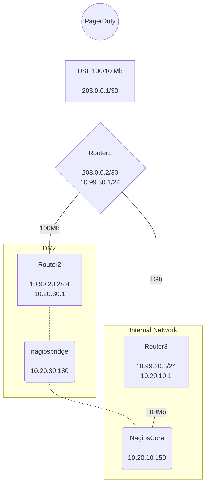

# Nagios_v3_NextGen_onprem

PagerDuty integration for Nagios, uses webhook v3 and sends commands to nagios using NRDP

Nagios NRDP <https://github.com/NagiosEnterprises/nrdp> is required for this to work
it is included in Nagios XI however for NagiosCore you will need to install this https://support.nagios.com/kb/article/nrdp-installing-nrdp-from-source-602.html

External command support will be included
<https://assets.nagios.com/downloads/nagioscore/docs/externalcmds/>

This integration is designed to be run from a DMZ box with a remote connection to a nagios server running nrdp however can be run on the same machine as nrdp

# Icinga Support

Icinga2 does not have support for NRDP, additionally external command file support is deprecated https://icinga.com/docs/icinga-2/latest/doc/14-features/#external-command-pipe

this integration should currently work with external command file with Icinga2 however this is untested and support from Icinga may end at any time

## Comparison to the old version

|     **Requirement**    |       **Old Version**       |                    **New Version**                    |                                                                                                                     **Comment**                                                                                                                    |   |
|:----------------------:|:---------------------------:|:-----------------------------------------------------:|:--------------------------------------------------------------------------------------------------------------------------------------------------------------------------------------------------------------------------------------------------:|:-:|
| Webhook security       | Basic authentication        | HMAC SHA256 signed webhook                            | New version can also support mTLS                                                                                                                                                                                                                  |   |
| Command Support        | Acknowledge & Unacknowledge | annotation, acknowledge, unacknowledge & More to come | New version can support all webhook v3 payloads and selectable from the PD webinterface                                                                                                                                                            |   |
| NRDP Support           | Not possible                | Built in                                              | NRDP allows the nagios commands removes the requirement to directly publish the nagios host to the internet                                                                                                                                        |   |
| External Commmand File | Built in                    | Complete                                              | Direclty writing to the external command file requires the web interface to operate from the nagios core server and published to the internet                                                                                                      |   |
| Multiple Integrations  | Built In                    | Complete                                              | Old design worked with individual extensions added to each service, new design works with WebhookV3 subscriptions and can support all services in a subdomain and handles multiple HMAC signatures |   |

***Example Configuration used in development***

***TODO***

* Base logic
- [X] On incident resolve remove ack? & trigger next check?
- [X] Handle all actions for services
- [X] Support more than one webhook subscription (Multiple signatures)
- [X] Support writing to the nagios command file directly like the old cgi did

* Additional functionality which I am actively working on

- [ ] Support grouped alerts in PagerDuty

* Additional functionality which I am considering

- [ ] Support sending webhook to the old CGI

***Nice To Add***

* Incident reasigned
- [ ] Add comment to show who it has been assigned to
* Incident escalated
- [ ] same behaviour as the reassignment
* Priority updated
- [ ] show priority as a comment
* Responder added
- [ ] add comment of who was added
* Responder replied
- [ ] add reply from the responder in comment
* Status update posted
- [ ] Add as comment
