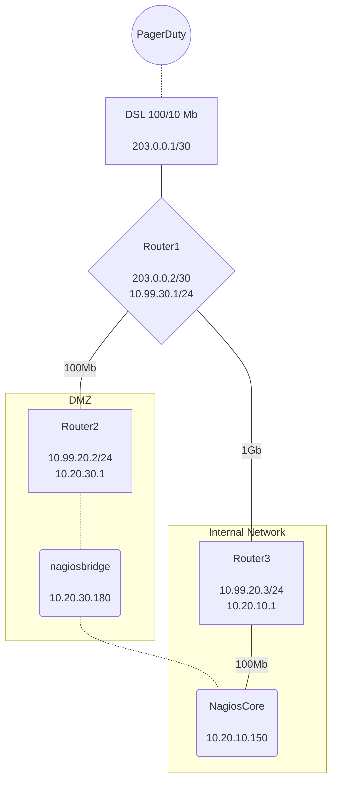

---

# PagerDuty Bi-directional Nagios Integration

- [PagerDuty Bi-directional Nagios Integration](#pagerduty-bi-directional-nagios-integration)
- [1. Installation](#1-installation)
  - [1.1. Step 1 - Installation on webserver](#11-step-1---installation-on-webserver)
  - [1.2. Step 2 - Configuration within PagerDuty](#12-step-2---configuration-within-pagerduty)
- [2. PD2Nagiosv3](#2-pd2nagiosv3)
- [3. Icinga Support](#3-icinga-support)
- [4. Comparison to the old version](#4-comparison-to-the-old-version)
- [Future development ?](#future-development-)
    - [Support grouped alerts in PagerDuty](#support-grouped-alerts-in-pagerduty)

*** 

Before you begin, you should review the [Updated Guide](https://github.com/Nozlaf/PD2Nagiosv3/blob/main/updated_guide.md) it contains information about how to send events TO PagerDuty from Nagios, this was not my orignial intention however due to deprecations on the PD side for their Nagios to PD integration this is necessary

# 1. Installation 

## 1.1. Step 1 - Installation on webserver

Place the pagerduty.php on a webserver accessible by the IP's listed for the relevant service region [PagerDuty Webhook IP's](https://developer.pagerduty.com/docs/9a349b09b87b7-webhook-i-ps)

This webserver will also need to be able to reach the NRDP interface for your Nagios Core or Nagios XI installation

## 1.2. Step 2 - Configuration within PagerDuty
generate a webhook v3 within your PagerDuty environment
  * 1st, within pagerduty click "integrations" from the top menu
  * 2nd, click Generic Webhooks (v3))
  * 3rd, click "+New Webhook"
    * Webhook URL needs to be the public url where your pagerduty.php file can be accessible from
    * scope type depends on your environment, - you can add multiple integrations by addding multiple webhooks
      * if all your PagerDuty services use Nagios then select Account
      * if all your PagerDuty services which are integrated with Nagios are owned by a single team select Team
      * if you only have a limited number of services which integrate with Nagios select service

# 2. PD2Nagiosv3

PagerDuty integration for Nagios, uses webhook v3 and sends commands to nagios using NRDP

Nagios NRDP <https://github.com/NagiosEnterprises/nrdp> is required for this to work
it is included in Nagios XI however for NagiosCore you will need to install this https://support.nagios.com/kb/article/nrdp-installing-nrdp-from-source-602.html

External command support will be included
<https://assets.nagios.com/downloads/nagioscore/docs/externalcmds/>

This integration is designed to be run from a DMZ box with a remote connection to a nagios server running nrdp however can be run on the same machine as nrdp

# 3. Icinga Support

Icinga2 does not have support for NRDP, additionally external command file support is deprecated https://icinga.com/docs/icinga-2/latest/doc/14-features/#external-command-pipe

this integration should currently work with external command file with Icinga2 however this is untested and support from Icinga may end at any time

# 4. Comparison to the old version

|    **Requirement**     |       **Old Version**       |                    **New Version**                    |                                                                                                                 **Comment**                                                                                                                 |       |
| :--------------------: | :-------------------------: | :---------------------------------------------------: | :-----------------------------------------------------------------------------------------------------------------------------------------------------------------------------------------------------------------------------------------: | :---: |
|    Webhook security    |    Basic authentication     |              HMAC SHA256 signed webhook               |                                                                                                      New version can also support mTLS                                                                                                      |       |
|    Command Support     | Acknowledge & Unacknowledge | annotation, acknowledge, unacknowledge & More to come |                                                                           New version can support all webhook v3 payloads and selectable from the PD webinterface                                                                           |       |
|      NRDP Support      |        Not possible         |                       Built in                        |                                                                 NRDP allows the nagios commands removes the requirement to directly publish the nagios host to the internet                                                                 |       |
| External Commmand File |          Built in           |                       Complete                        | Direclty writing to the external command file requires the web interface to operate from the nagios core server and published to the internet or the DMZ box needs write access via the network to the external command file e.g. nfs share |       |
| Multiple Integrations  |          Built In           |                       Complete                        |                     Old design worked with individual extensions added to each service, new design works with WebhookV3 subscriptions and can support all services in a subdomain and handles multiple HMAC signatures                      |       |

***Example Configuration used in development***

#Curent Support

* Base logic
- [X] On incident resolve remove ack? & trigger next check?
- [X] Handle all actions for services
- [X] Support more than one webhook subscription (Multiple signatures)
- [X] Support writing to the nagios command file directly like the old cgi did

#TODO

  
* Additional functionality which I am considering

- [ ] Support sending webhook to the old CGI

***Nice To Add***

* Incident reasigned
- [ ] Add comment to show who it has been assigned to
* Incident escalated
- [ ] same behaviour as the reassignment
* Priority updated
- [ ] show priority as a comment
* Responder added
- [ ] add comment of who was added
* Responder replied
- [ ] add reply from the responder in comment
* Status update posted
- [ ] Add as comment

**** 
# Future development ? 
 
### Support grouped alerts in PagerDuty
* [ ] need to determine if this is necessary ?

My thoughts on the matter: 

currently webhooks will be sent based on the incident, but we need to get all the alerts associated with the incident to know which hosts we are acking etc..  maybe we should also add a note for all grouped incidents but that would be harder because we dont get a webhook for each alert added to an incident, we would need to add to the script which sends to PD to have it look up the incident after the alert is sent and add the note. this would be best handled by some sort of queue system

additionally the concept of a suspended or suppresed alert becomes even more difficult to manage in an integraiton like this, so lets keep this simple
