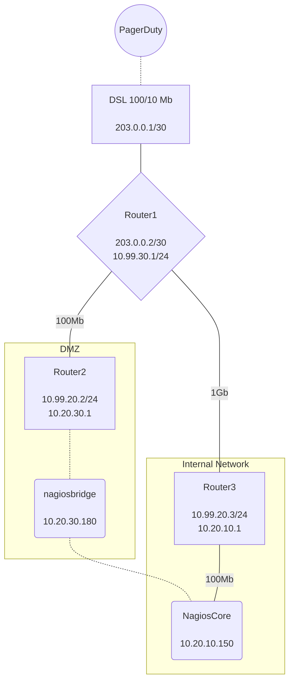

---

# PagerDuty Bi-directional Nagios Integration v1.2

- [PagerDuty Bi-directional Nagios Integration v1.2](#pagerduty-bi-directional-nagios-integration-v12)
- [1. Installation](#1-installation)
  - [1.1. Step 1 - Installation on webserver](#11-step-1---installation-on-webserver)
  - [1.2. Step 2 - Configuration within PagerDuty](#12-step-2---configuration-within-pagerduty)
- [2. PD2Nagiosv3](#2-pd2nagiosv3)
- [3. Icinga Support](#3-icinga-support)
- [4. Comparison to the old version](#4-comparison-to-the-old-version)
- [5. v1.2 Improvements](#5-v12-improvements)
- [Future development ?](#future-development-)
    - [Support grouped alerts in PagerDuty](#support-grouped-alerts-in-pagerduty)

*** 

Before you begin, you should review the [Updated Guide](https://github.com/Nozlaf/PD2Nagiosv3/blob/main/updated_guide.md) it contains information about how to send events TO PagerDuty from Nagios, this was not my original intention however due to deprecations on the PD side for their Nagios to PD integration this is necessary

# 1. Installation 

## 1.1. Step 1 - Installation on webserver

Place the `PD2Nagiosv3_pagerduty.php` on a webserver accessible by the IP's listed for the relevant service region [PagerDuty Webhook IP's](https://developer.pagerduty.com/docs/9a349b09b87b7-webhook-i-ps)

This webserver will also need to be able to reach the NRDP interface for your Nagios Core or Nagios XI installation

**Requirements:**
- PHP 8.0+ (tested with PHP 8.3.6, 8.1.2, 8.0.8)
- cURL extension
- JSON extension
- File write permissions for debug logging and IP caching

## 1.2. Step 2 - Configuration within PagerDuty

Generate a webhook v3 within your PagerDuty environment:
  * 1st, within pagerduty click "integrations" from the top menu
  * 2nd, click Generic Webhooks (v3))
  * 3rd, click "+New Webhook"
    * Webhook URL needs to be the public url where your `PD2Nagiosv3_pagerduty.php` file can be accessible from
    * scope type depends on your environment - you can add multiple integrations by adding multiple webhooks
      * if all your PagerDuty services use Nagios then select Account
      * if all your PagerDuty services which are integrated with Nagios are owned by a single team select Team
      * if you only have a limited number of services which integrate with Nagios select service

# 2. PD2Nagiosv3

PagerDuty integration for Nagios, uses webhook v3 and sends commands to nagios using NRDP or external command files.

**Supported Integration Methods:**
- **NRDP** (recommended): Uses Nagios Remote Data Processor for secure command transmission
- **FILE**: Writes directly to Nagios external command file

Nagios NRDP <https://github.com/NagiosEnterprises/nrdp> is required for NRDP method
it is included in Nagios XI however for NagiosCore you will need to install this https://support.nagios.com/kb/article/nrdp-installing-nrdp-from-source-602.html

External command support is documented at:
<https://assets.nagios.com/downloads/nagioscore/docs/externalcmds/>

This integration is designed to be run from a DMZ box with a remote connection to a nagios server running nrdp however can be run on the same machine as nrdp

**Supported Event Types:**
- `incident.annotated` - Add comments to Nagios services/hosts
- `incident.acknowledged` - Acknowledge Nagios problems
- `incident.unacknowledged` - Remove acknowledgements
- `incident.escalated` - Remove acknowledgements
- `incident.delegated` - Remove acknowledgements  
- `incident.resolved` - Remove acknowledgements
- `pagey.ping` - Health check endpoint

# 3. Icinga Support

Icinga2 does not have support for NRDP, additionally external command file support is deprecated https://icinga.com/docs/icinga-2/latest/doc/14-features/#external-command-pipe

This integration should currently work with external command file with Icinga2 however this is untested and support from Icinga may end at any time

# 4. Comparison to the old version

| **Requirement**        | **Old Version**             | **New Version**                                       | **Comment**                                                                                                                                                                                                                                 |
| ---------------------- | --------------------------- | ----------------------------------------------------- | ------------------------------------------------------------------------------------------------------------------------------------------------------------------------------------------------------------------------------------------- |
| Webhook security       | Basic authentication        | HMAC SHA256 signed webhook                            | New version can also support mTLS                                                                                                                                                                                                           |
| Command Support        | Acknowledge & Unacknowledge | annotation, acknowledge, unacknowledge & More to come | New version can support all webhook v3 payloads and selectable from the PD webinterface                                                                                                                                                     |
| NRDP Support           | Not possible                | Built in                                              | NRDP allows the nagios commands removes the requirement to directly publish the nagios host to the internet                                                                                                                                 |
| External Commmand File | Built in                    | Complete                                              | Directly writing to the external command file requires the web interface to operate from the nagios core server and published to the internet or the DMZ box needs write access via the network to the external command file e.g. nfs share |
| Multiple Integrations  | Built In                    | Complete                                              | Old design worked with individual extensions added to each service, new design works with WebhookV3 subscriptions and can support all services in a subdomain and handles multiple HMAC signatures                                          |

# 5. v1.2 Improvements

**Enhanced Security & Error Handling:**
- Comprehensive input validation and sanitization
- Proper HTTP status codes (401, 403, 405, 500)
- SSL verification for all API calls
- Enhanced signature validation with better error reporting
- Improved IP filtering with caching and fallback mechanisms

**Code Quality & Maintainability:**
- Modern PHP syntax (array shorthand, null coalescing, strict comparison)
- Comprehensive PHPDoc documentation for all functions
- Structured error handling with try-catch blocks
- Enhanced debug logging with timestamps and structured output
- Better code organization with switch statements

**Performance & Reliability:**
- Improved caching for PagerDuty IP lists
- Better timeout handling for API calls
- Enhanced exception handling throughout the application
- More robust JSON parsing and validation

***Example Configuration used in development***

```mermaid
graph TD;
 linkStyle default interpolate basis
 wan1[<center>DSL 100/10 Mb<br><br>203.0.0.1/30</center>]---router{<center>Router1<br><br>203.0.0.2/30 <br> 10.99.30.1/24</center>}
 PD((<center><br>PagerDuty<br><br></center>))-.-wan1
 router---|100Mb|router2[<center>Router2<br><br>10.99.20.2/24</br>10.20.30.1</center>]
 router---|1Gb|router3[<center>Router3<br><br>10.99.20.3/24</br>10.20.10.1</center>]
 nagiosbridge-.-nagioshost
 subgraph DMZ
 router2-.-nagiosbridge(<center>nagiosbridge<br><br>10.20.30.180</center>)
 end
 subgraph Internal Network
 router3---|100Mb|nagioshost(<center>NagiosCore<br><br>10.20.10.150</center>)
 end
```

# Current Support

* Base logic
- [X] On incident resolve remove ack? & trigger next check?
- [X] Handle all actions for services
- [X] Support more than one webhook subscription (Multiple signatures)
- [X] Support writing to the nagios command file directly like the old cgi did
- [X] Support PagerDuty webhook IP filtering "soft firewall"
- [X] ability to support multiple webhooks from PD
- [X] ability to support webhook validation (HMAC) from PD
- [X] Enhanced error handling and security (v1.2)
- [X] Comprehensive debug logging (v1.2)
- [X] Modern PHP syntax and best practices (v1.2)
- [ ] ability to route to different Nagios instances - Work in progress 

# TODO

* Additional functionality which I am considering

- [ ] Support sending webhook to the old CGI

***Nice To Add***

* Incident reassigned
- [ ] Add comment to show who it has been assigned to
* Incident escalated
- [ ] same behaviour as the reassignment
* Priority updated
- [ ] show priority as a comment
* Responder added
- [ ] add comment of who was added
* Responder replied
- [ ] add reply from the responder in comment
* Status update posted
- [ ] Add as comment

**** 
# Future development ? 
 
### Support grouped alerts in PagerDuty
* [ ] need to determine if this is necessary ?

My thoughts on the matter: 

currently webhooks will be sent based on the incident, but we need to get all the alerts associated with the incident to know which hosts we are acking etc.. maybe we should also add a note for all grouped incidents but that would be harder because we don't get a webhook for each alert added to an incident, we would need to add to the script which sends to PD to have it look up the incident after the alert is sent and add the note. this would be best handled by some sort of queue system

additionally the concept of a suspended or suppressed alert becomes even more difficult to manage in an integration like this, so lets keep this simple
